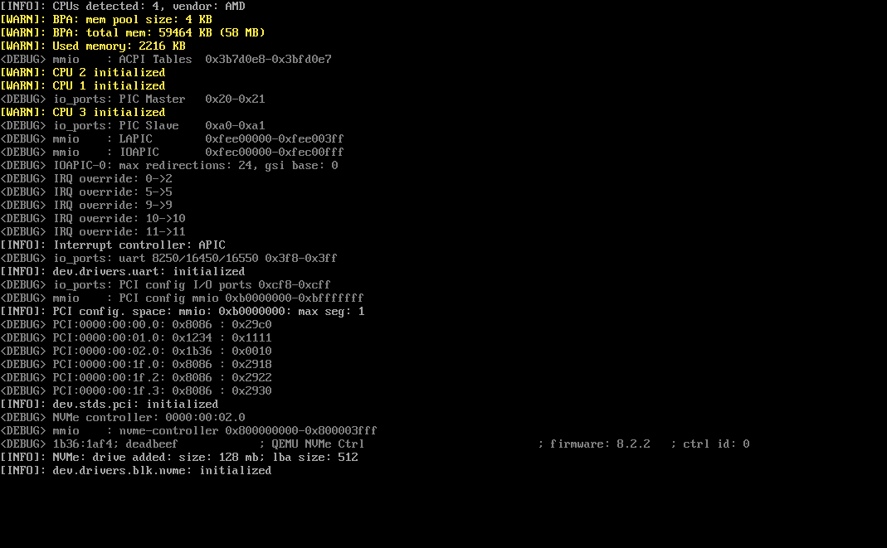

<p align="center">
  <a href="https://github.com/bagggage/bamos/wiki" target="_blank" rel="noopener noreferrer"></a>
</p>

---

It is an **open-source** operating system project written in the Zig programming language.

BamOS does not introduce new standards but strives for the **best** possible implementation of existing ones.

## Overview

The main feature and goal of this project is to develop a **lightweight** and **extremely fast** operating system with a **well-documented**, **concise**, and **simple** codebase, as much as possible.

It aims to include native support for multiple system ABIs between the kernel and user space (GNU/Linux, Windows NT, etc.) simultaneously. This should significantly improve the user experience and simplify the work for software developers.

<p align="center">
  
</p>

## Why Zig?

Despite the familiar and established languages like C/C++ or the possibly safer Rust, our choice is Zig.

Zig is simple enough to be more maintainable than Rust while offering a safer and more functional alternative to C/C++. Zig allows generating high-speed and optimized machine code, and one of its main advantages is the build system, which makes the compilation process seamless and incredibly simple.

To create a kernel executable, all you need is the source code, the Zig compiler, and the command `zig build kernel`.

## Documentation

The **OS** documentation is available on [this page](https://github.com/bagggage/bamos/wiki).

The **kernel** documentation base on code is available on [this page](https://bagggage.github.io/bamos/).
If you want to generate the documentation locally, run the following command:

```bash
zig build docs
```

A static site will be placed in the `docs` directory, which can then be launched using:

```bash
cd docs
python -m http.server
```

The Zig language description and documentation for its standard library can be found on the [official website](https://ziglang.org/).

## Contributing

BamOS is still a small but **growing** project.  
We welcome any contributions and invite you to participate in the development and evolution of the project.

See information on [contributing](./CONTRIBUTING.md).

## Building from Source

The build process is quite straightforward:

- Before you begin, ensure that the Zig compiler version [0.13.0](https://ziglang.org/download/) is installed on your workstation.

```bash
git clone https://github.com/bagggage/bamos.git
cd bamos
zig build kernel --release=[small|safe|fast]
```

By default, the build result will be located in the `.zig-out` directory. To specify a different path, use the `--prefix=[path]` option during the build.

## Creating an Image

Currently, the OS relies on the third-party [BOOTBOOT](https://gitlab.com/bztsrc/bootboot) bootloader, and the `bootboot/mkbootimg` utility is used to create the image. In the future, this stage is planned to be simplified and made more cross-platform. However, for now, to create an image, you need to:

- Obtain precompiled [BOOTBOOT](https://github.com/bagggage/bootboot-bin) binaries. And unzip `mkbootimg` for your host OS.
- Specify the path to the `bootboot-bin` directory by setting the `BOOTBOOT` variable in `env.sh`.
- Run `iso.sh`.

By default, the image will be placed in the `dist` directory.

## Running

For quick OS testing and launch, it is recommended to use the [QEMU](https://www.qemu.org) emulator.  
On **Windows**, you should also add the `qemu` directory in the `PATH` environment variable beforehand.

In the project's root directory, there are the `qemu.sh` and `debug.sh` scripts:

- `qemu.sh` runs a pre-built system image (by default `dist/bamos.iso`) in the emulator.
- `debug.sh` compiles, creates the image, and runs the system in the emulator.

## Details

BamOS is at an early stage of development, and many things are not yet implemented. Moreover, writing the implementation and developing the operating system architecture requires an iterative approach to find the best solutions, so some details may change, but this is all for the better.

## Current State

- x86-64 architecture support.
- Virtual memory management system.
- Logging system.
- Hardware exceptions.
- Device management system.
- Interrupt handling system.
- PCI bus driver.
- NVMe driver.

## Planned Features

- Virtual file system (in progress).
- Various file system drivers (ext2..4, NTFS, FAT32, etc.).
- Drivers for other solid-state storage standards.
- Processes architecture, scheduling.
- System calls architecture and kernel-process interaction with support for various ABIs.
- And much more...