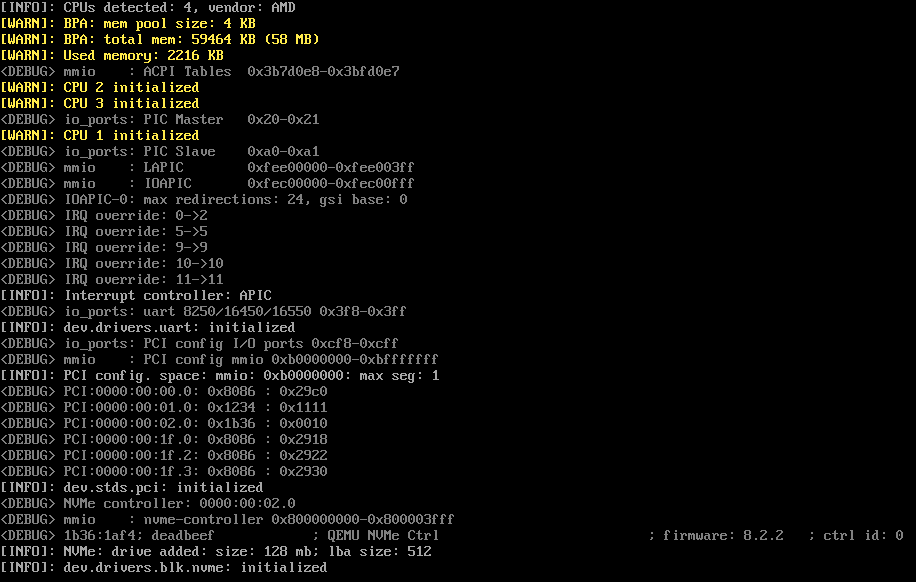

<p align="center">
  <a href="https://bagggage.github.io/bamos-book/" target="_blank" rel="noopener noreferrer"></a>
</p>

---

It is an **open-source** operating system project written in the Zig programming language.

BamOS does not introduce new standards but strives for the **best** possible implementation of existing ones.

## Overview

The main feature and goal of this project is to develop a **lightweight** and **fast** operating system with a **well-documented**, **concise**, and **simple** codebase, as much as possible.

It aims to include native support for multiple system ABIs between the kernel and user space (GNU/Linux, Windows NT, etc.) simultaneously. This should significantly improve the user experience and simplify the work for software developers.

<p align="center">
  
</p>

## Why Zig?

Despite the familiar and established languages like C/C++ or the possibly safer Rust, our choice is Zig.

Zig is simple enough to be more maintainable than Rust while offering a safer and more functional alternative to C/C++. Zig allows generating high-speed and optimized machine code, and one of its main advantages is the build system, which makes the compilation process seamless and incredibly simple.

To create a bootable image, all you need is the source code, the Zig compiler, and the command `zig build`.

## Contributing

BamOS is still a small but **growing** project.  
We welcome any contributions and invite you to participate in the development and evolution of the project.

See information on [contributing](./CONTRIBUTING.md).

## Building from Source

Before you begin, ensure that the Zig compiler version [**0.15.2**](https://ziglang.org/download/) is installed on your workstation.

The build process is quite straightforward:

```sh
git clone https://github.com/bagggage/bamos.git
cd bamos
zig build --release=[off|small|safe|fast]
```

This will build the kernel `bamos.elf` and create a bootable image `bamos.iso`. By default, the build result will be located in the `zig-out` directory.
To specify a different path, use the `--prefix=[path]` option during the build.

### Options

- `zig build kernel`  : build kernel executable
- `zig build iso`     : create bootable image
- `zig build qemu`    : run image in QEMU
- `zig build docs`    : generate kernel documentation (destination: `/docs`)

Use `zig build -h` to learn more.

### Running and testing

For quick OS testing and launch, it is recommended to use the [QEMU](https://www.qemu.org) emulator.  
On **Windows**, you should also add the `qemu` directory in the `PATH` environment variable beforehand.

```sh
zig build qemu --release=safe
```

You can configure virtual machine by passing different options `-Dqemu-*`,
use `zig build -h` to learn more.

## Documentation

The general **OS** documentation is available on [this page](https://bagggage.github.io/bamos-book/).

The code documentation is available on [this page](https://bagggage.github.io/bamos/).
If you want to generate the documentation locally, run the following command:

```sh
zig build docs
```

A static site will be placed in the `/docs` directory, which can then be launched using:

```sh
cd docs
python -m http.server
```

The Zig language description and documentation for its standard library can be found on the [official website](https://ziglang.org/).

## Details

BamOS is at an early stage of development, and many things are not yet implemented. Moreover, writing the implementation and developing the operating system architecture requires an iterative approach to find the best solutions, so some details may change, but this is all for the better.

## Current Progress

To track what has already been implemented in the project
and what stage it is currently at, check out [**this page**](https://bagggage.github.io/bamos-book/current-progress).